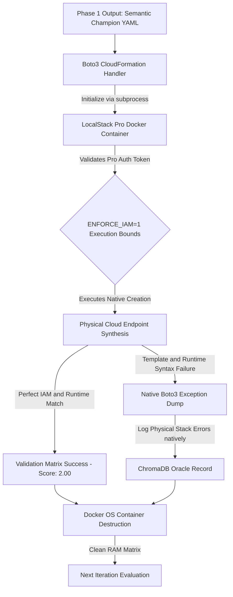

# Static IaC Evaluation Pipeline Architecture

This document details the mechanics of the AWS SAM validation orchestrator, the compiler constraints utilized, and the logic parameters applied during the loop.

## Problem Statement

Language Model generation for functional Infrastructure as Code configurations generally fails against standard compiler evaluations due to specific engineering boundaries:
1. **API Inconsistencies:** Open-source architectures inherently omit configuration parameters mandated by AWS `cfn-lint` verification rules.
2. **Context Generalization:** Bayesian models execute generalized inferences. Synthesized outputs consistently lack precision relative to functional topology structures.
3. **Discrete Evaluation Scaling:** Output validation processes inherently operate using boolean logic gates. Generative models cannot easily traverse logic parameters without fractional feedback metrics separating structural syntax.

## Core Implementations

### Sequential Optimization Loop (DSPy MIPROv2)
The script executes a DSPy MIPROv2 vector loop orchestrating dynamic validation interactions across distinctly bounded architecture models:
1. **The Optimizer** (`gpt-4o`): Parses compilation exceptions and dynamically refines baseline prompt text instructions according to mathematical ChromaDB gradients.
2. **The Evaluators** (`gpt-4o` and `claude-3.7-sonnet`): Execute the optimized prompts directly to generate the target SAM payloads. The optimization engine strictly averages the compilation scores across both disparate models to objectively verify prompt generalization over internal model bias.

### The Evaluator Pipeline (`src/evaluators.py`)
Model API endpoints ingest defined string structures and generate Serverless YAML output syntax. The YAML operates seamlessly inside an execution pipeline:
1. **RAM Disk Pathing:** As absolute compiler paths (`cfn-lint`) require static bytes to process checks securely, the script generates the active test file directly to a physical RAM Disk path (`R:\`). This isolates disk writing structures, eliminating traditional file I/O latency.
2. **Format Standard Loading:** `yaml.safe_load` secures the physical variables securely in memory.
3. **Specification Verification:** The `cfn-lint` validation parameters execute against the syntax directly, providing JSON error structures.
4. **Operations Compliance Enforcement:** The `cfn-guard validate` engine checks exact variables against defined parameters embedded internally.
5. **Decay Grading Calculation (`math.exp`):** The sum of captured code exceptions converts linearly into exponential fraction reductions. A script generating 8 exception logic gates calculates a higher absolute modifier than an equivalent compilation raising 17 exceptions.
6. **Semantic Output Parsing:** `gpt-4o` executes direct string comparison logic against outputs. When external linting boundaries process smoothly (`1.00`), a semantic judge verifies the physical requirements against the functional intent structure.

### Dynamic Pipeline Data Handling (`src/data_loader.py`)
A custom initialization specification parses the AWS schema network directly. During DSPy retrieval evaluation loops, the script executes a **Multi-Q Cross-Cluster Strategy**:
1. It queries ChromaDB explicitly for AWS API boundaries (Targeting mathematical Spec isolation).
2. It executes a secondary query isolating strictly `cfn-guard` exceptions (Targeting Security Tracebacks natively without user prompt keywords).
3. It performs a final query mapping API Version Deprecation bounds (Isolating `cfn-lint` structural limits).

This dynamic semantic separation physically guarantees the generated matrix contains equal distributions of framework instruction AND compilation warnings dynamically independent of the query constraints!

### Compilation Boundary Bypass (Semantic Generation)
Compliance enforcement objects defined within `cfn-guard` reject YAML templates that omit target parameters. The evaluation pipeline executes a dedicated Python generation request against the internal AWS `aws-samples` GitHub repository to bypass static boundaries.
1. `scratch/scraper.py` parses AWS SAM outputs.
2. The code functionally validates the structures against the primary evaluator script, computing `AES256` keys to strictly conform external samples with local schema restrictions manually in execution variables.
3. It stores standard baseline implementations within `results/optimization/run_seed_champions`. MIPROv2 parses these sample benchmarks into evaluation targets locally as DSPy reference files.

### Phase 2: Ephemeral Hardware Execution Sandbox
While static evaluation boundaries guarantee optimal formatting parameters computationally, functional execution requires physical cloud testing. The architecture natively implements a decoupled Phase 2 optimizer (`scratch/test_localstack.py`) that boots ephemeral container environments logically mapping physical IAM bounds:

The Phase 2 loop explicitly bypasses standard Python `testcontainers` wrappers directly to interface securely with native LocalStack Pro Docker instances. This enables strict OS-level container destruction independent of Boto3 timeout handlers, ensuring memory leaks do not disrupt long-running DSPy inference sweeps dynamically.
