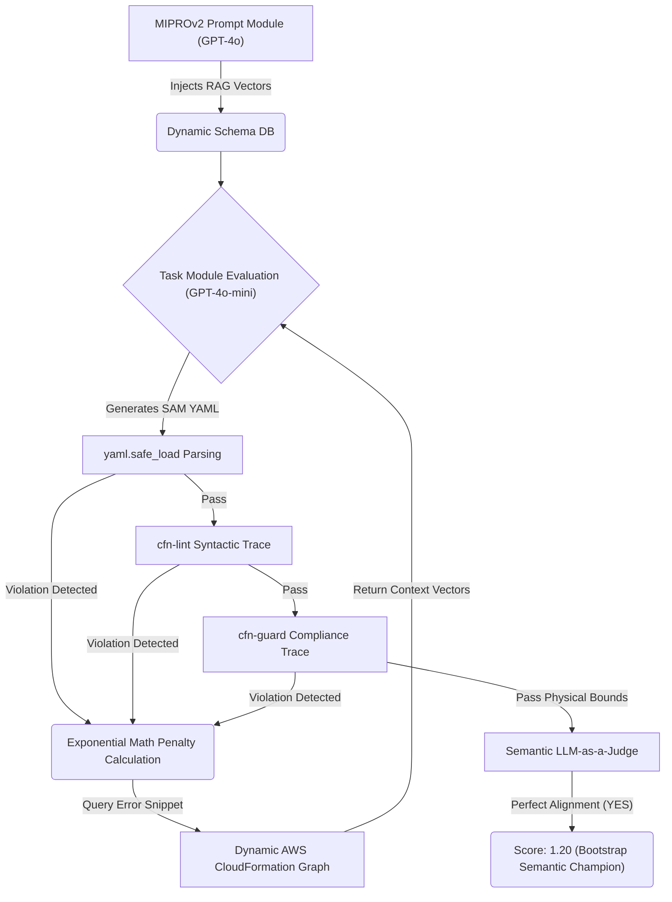

# Autonomous Infrastructure Prompter — AWS SAM Bayesian Engine

This project defines a bleeding-edge static evaluation pipeline for optimizing generated Infrastructure-as-Code schemas. The system utilizes DSPy **MIPROv2** to Bayesian-search target parameter configurations capable of coercing language models to generate precise, perfectly declarative, WAFR-compliant AWS Serverless Application Model architectures.

## Architecture Workflow




## The 5 Pillars of Evaluation

1. **Pre-emptive Web RAG Ingestion:** The engine dynamically scours `d1uauaxba7bl26.cloudfront.net` upon initialization, seamlessly downloading and injecting perfectly updated AWS CloudFormation schema metrics directly into your ChromaDB parameters. 
2. **Two-Model Separation:** Heavy instruction drafting is strictly pushed to high-IQ `gpt-4o` arrays, whereas iteration cycle validations are isolated directly to `gpt-4o-mini`, perfectly dividing pipeline velocity and mathematical complexity.
3. **Continuous Scoring Functions (`math.exp`):** The Bayesian gradients will scale linearly against partial code output. An LLM solving 15 AWS linting trace bounds out of 20 will organically generate a substantially higher continuous score modifier than an LLM entirely freezing the schema structure.
4. **LLM-as-a-Judge (Semantic Overloading):** To cross the final `1.20` execution barrier, physical structural bounds (`cfn-guard` and `cfn-lint`) are no longer sufficient natively. `gpt-4o-mini` is natively injected to assess the output physically against your generated input intent. 
5. **Bootstrapped Dynamic Trainsets:** Any generated payload scoring a `>= 1.20` is intrinsically scooped straight back into the DSPy instance as a natively organic few-shot `Example()`.

## Environment Configuration

Before running any script logic, configure required system telemetry bounds.

```bash
cp .env.example .env
```

Review the `.env` structure directly:
* `OPENAI_API_KEY`: API authentication key required to power the primary verification model instance and the native Semantic Evaluator (e.g. sk-...).
* `OPENROUTER_API_KEY`: Fallback key utilized for dispatching test evaluation runs to Llama and Deepseek LLM clusters dynamically.

## Required Installation

```bash
python -m venv venv
venv\Scripts\activate
pip install -r requirements.txt
```

To function correctly, the native host system must include accessible system aliases pointing to the strict evaluation binaries.
* Execute `pip install cfn-lint` inside the virtual environment for linting coverage.
* Manually download or compile the `cfn-guard` execute object and attach it securely within `./venv/Scripts/cfn-guard.exe`.

## Execution Protocol

Initiate the Web RAG database engine (Requires Internet Connection) globally:

```bash
venv\Scripts\python.exe scripts/ingest_sam_docs.py
```

Begin standard parameter alignment with automated optimization thresholds (e.g., `light`, `medium`, `heavy`):

```bash
venv\Scripts\python.exe scripts/optimize.py --auto medium
```

If previous evaluation data exists, initialize a stateful configuration recovery protocol by specifying the local resume parameter:

```bash
venv\Scripts\python.exe scripts/optimize.py --auto medium --resume
```

## Known Limitations & Future Work

1. **Missing Physical Integration:** The system validates code via `cfn-lint` natively mapped against AWS Serverless syntax. It explicitly does not invoke `sam deploy` against a target physical environment. Verification is inherently structural and semantic, not statically deployed.
2. **Security Protocol Bias:** `cfn-guard` policies exclusively check JSON syntax structurally mapping against open-source policies. A language model implicitly trained against the pipeline architecture could artificially generate semantic compliance capable of tricking lint string pattern matching while leaving actual parameters explicitly vulnerable.
