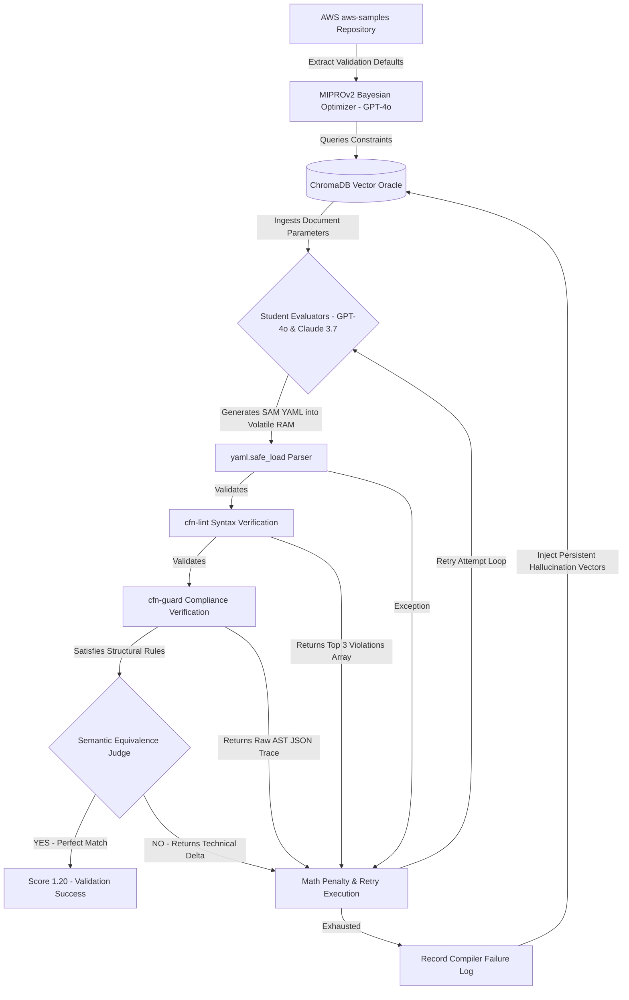

# Automated Serverless Infrastructure Engine

This repository provides a static evaluation pipeline for optimizing generated Infrastructure as Code (IaC) templates. The system integrates the DSPy MIPROv2 framework to compute optimized prompt parameters, enabling the generation of AWS Serverless Application Model (SAM) architectures that comply with AWS Well-Architected Framework guidelines.

## Architecture Workflow



## Core Evaluation Components

1. **Pre-emptive Data Ingestion:** The system parses `d1uauaxba7bl26.cloudfront.net` during initialization to download documented AWS CloudFormation schema parameters into a local ChromaDB instance.
2. **Dual-Model Execution:** Processing is divided across two models. Instruction synthesis utilizes `gpt-4o`, while continuous trace execution runs on `anthropic/claude-3.7-sonnet`.
3. **Continuous Scoring Functions (`math.exp`):** The optimization gradients scale linearly against partial code outputs. A template passing 15 of 20 validation checks calculates a mathematically higher score multiplier than a template with complete structural failure, bypassing discrete boolean logic gates. The pipeline computes the evaluation vector using exponential parameter decay:

   $$ \text{Total Score} = \max\left(0, \left[ 0.20 + 0.40e^{-0.5 L} + 0.40e^{-0.5 G} + 0.20 S \right] - 0.10 A \right) $$

   *Where $L$ executes the aggregate sum of `cfn-lint` syntax errors, $G$ aggregates `cfn-guard` compliance violations, $S \in \{0, 1\}$ maps structural intent via LLM semantic judgment, and $A \in \{0, 1, 2\}$ tracks recursive generation attempt penalties.*
4. **Semantic Verification:** To achieve maximum execution parameters, the script utilizes `gpt-4o` to physically compare output semantic alignments against input specifications, validating structures beyond basic `cfn-lint` syntax.
5. **Bootstrapped Dataset Execution:** The codebase implements an extraction script that queries the `aws-samples/serverless-patterns` repository. It filters and provides compliant SAM architectures mapped to explicitly defined architecture targets. MIPROv2 passes these examples into the DSPy instances as execution parameters.
6. **Volatile OS Integration (RAM Disk):** The codebase performs temporary verification workloads into a volatile system RAM drive (e.g., `R:\`) to bypass physical SSD input/output latency associated with the execution of the `cfn-lint` and `cfn-guard` binaries.

## Step 0: Environment Configuration

Before running any script logic, configure the required system constraints. Copy the provided `.env.example` file to create your `.env` configuration file and populate all listed variables.

```bash
cp .env.example .env
```

Review the `.env` structure:
* `OPENAI_API_KEY`: API authentication key.
* `OPENROUTER_API_KEY`: API authentication key utilized for OpenRouter requests.

## Installation

```bash
python -m venv venv
venv\Scripts\activate
pip install -r requirements.txt
```

To function correctly, the host system must map system aliases pointing to the evaluation binaries:
* Execute `pip install cfn-lint` inside the virtual environment for linting logic.
* Download the `cfn-guard` executable directly and attach it within `./venv/Scripts/cfn-guard.exe`.

## Execution Commands

Initialize the vector database locally (Requires Internet Connection):

```bash
venv\Scripts\python.exe scripts/ingest_sam_docs.py
```

Begin standard parameter alignment with standard optimization thresholds:

```bash
venv\Scripts\python.exe scripts/optimize.py --auto medium
```

If previous evaluation data exists securely on disk, initialize the recovery state by specifying the resume flag:

```bash
venv\Scripts\python.exe scripts/optimize.py --auto medium --resume
```

## Known Limitations & Future Work

1. **Missing Deployment Integration:** The system validates code via `cfn-lint` strictly against AWS Serverless syntax and physical constraints. It does not invoke `sam deploy` against an active target AWS physical environment. Current verification is structurally semantic and statically evaluated. Production usage requires an explicit isolated deployment test pipeline.
2. **Security Protocol Generalization:** The `cfn-guard` policies exclusively check JSON syntax structures by mapping them to local logic files. A language model implicitly trained against the pipeline architecture could artificially format schema implementations to bypass string pattern matching algorithms, leaving the underlying architecture explicitly vulnerable to production security exploits.
3. **Windows Operating System Dependency:** The virtual environment binary routing (`cfn-guard.exe`) relies on standard Windows NT file path formats. A standard Linux machine requires structural path rewriting inside `evaluators.py`.
