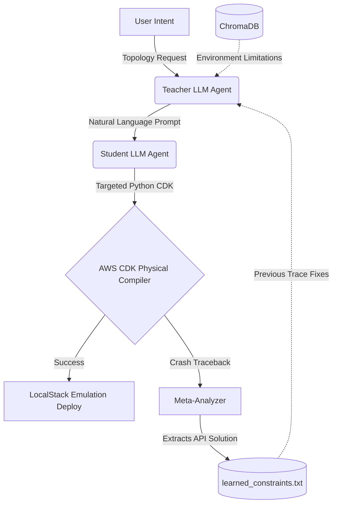

# IaC Self-Healer

An autonomous orchestration loop that generates, compiles, and reiterates AWS CDK infrastructure code using runtime validation.

## Architecture Concept

Generating Infrastructure-as-Code (IaC) via zero-shot Large Language Models frequently results in invalid dependency topological structures or outdated JSII constructs. 

**IaC Self-Healer** resolves this by executing a continuous validation pipeline built on a **Teacher-Student Zero-Shot Architecture**. It uses **Zero-Trust Physical Proofing** to bypass LLM hallucinations and mathematically converge on deployable cloud hardware.



### Execution Workflow

The system enforces structural validity through the following discrete steps:
1. **Teacher Generation**: The Teacher creates an instructional markdown prompt mapping the user's architectural intent. It reads environment limitations dynamically from `ChromaDB` (e.g. "Do not use SSM or RDS inside LocalStack").
2. **Student Execution**: A segmented Student Coder strictly reads the Teacher's Prompt and synthesizes Python AWS CDK v2 code. 
3. **Zero-Trust Physical Proofing**: The code bypasses abstract LLM linters and hits the real compiler.
    * `flake8` executes static syntax checking.
    * `npx cdk synth` evaluates JSII constraints and generates CloudFormation.
    * The CDK stack deploys directly into a LocalStack Docker container.
4. **Deterministic Context Reflection**: If compilation crashes, the literal stack trace is extracted. A Meta-Analyzer translates the physical crash into a hard rule. Crucially, the orchestrator mechanically forces the rule into the `learned_constraints.txt` memory block, permanently blocking the hallucination on the next iteration cycle.

## The DSPy Integration

Instead of relying on prompt parameter adjustments via MIPROv2, this project pivots to use DSPy purely for its structural programmatic abstraction. The core logic relies on physical environment limitations mapped into ChromaDB RAG layers rather than recursive Bayesian probability tests.

### Custom Prompt Ingestion

The repository supports mapping internal documentation directly into the generation layer.
1. Place standard markdown architectures (e.g., `Serverless.md`, `EKS_Baseline.md`) into the offline `chroma_db/`.
2. Execute the engine natively. The system reads and maps hardware limits natively.

## System Overview

*   **Next.js Dashboard (`/ui/`)**: A client-side web interface using Server-Sent Events to render compilation telemetry.
*   **Orchestration Logic (`scripts/self_healing_optimizer.py`)**: Sub-process logic orchestrating lockfiles, LocalStack polling, and RAG data injection.
*   **Prompt Engine (`generate.py`)**: The runtime override orchestrator guaranteeing Deterministic Rule injection on markdown artifacts.

## Installation

### Step 0: Environment Configuration
Duplicate `.env.example` into a local `.env` file at the root repository. Populate all keys, notably defining your endpoint API structure and your LocalStack API token.

### Backend Requirements
*   Python 3.8+
*   Node.js (For the underlying V8 engine utilized by AWS CDK JSII wrappers)
*   Docker Desktop running natively

```bash
python -m venv venv
venv\Scripts\activate
pip install -r requirements.txt
```

### Dashboard Initialization
```bash
cd ui
npm install
npm run dev
```

## Running the Engine

1. Execute `npm run dev` and navigate to `localhost:3000`.
2. Provide standard text intent and instantiate the compiler logic.
3. System logs dynamically push to `results/learning_loop/run_<timestamp>/` folders.
4. If manual termination is required, invoke the cancellation flag on the UI to gracefully spin down the threading locks.

## Extensibility & Throughput Scaling

Because DSPy validation physically instruments dependent architecture binaries rather than purely virtual simulations, execution throughput is strictly bottlenecked by the compiler layer (`cdk synth` and Docker daemons) rather than LLM token streaming.

### Phase 1: Local Environment Constraints (Laptop)
*   **Docker Subsystem Overrides**: The default Docker Desktop resource allocations (used by LocalStack) constrain deployment IO. Increment allocated local memory limits to >=8GB and force allocation of all available CPU cores.
*   **Groq API Subsystem Replacement**: While current documentation points to `openai/gpt-4o`, migrating the native backend API target from OpenAI endpoints to internal Llama3 Groq LPU endpoints drastically reduces TTFT (Time-To-First-Token) bottlenecks on the generative execution phase. 

### Phase 2: High-Performance Infrastructure Deployment (Google Cloud)
*   **Avoid Serverless Topologies**: Cloud Run or Cloud Functions are insufficient due to ephemeral disk scaling limits when utilizing heavy NPM package caching alongside isolated Docker daemons.
*   **Compute Engine (IaaS)**: The most straightforward scale configuration employs dedicated high-CPU standard instances (e.g., GCP `c3` or `n2d-standard-32`). This allows for maximum parallel ThreadPool configuration. 
*   **GKE Batch Processing (Containerized Loop)**: For optimal scale, the `cdk-testing-ground` should be extracted from local runtime into standalone Kubernetes batch execution jobs. This isolates file-lock conflicts concurrently, allowing hundreds of architecture proposals to compile within horizontal nodes against dedicated Kubernetes LocalStack StatefulSets.

## Known Limitations & Future Work

1. **Child Daemon Locking**: The system currently terminates orphaned `node.exe` processes executing `cdk` wrappers using Windows native WMI logic to bypass directory access locking. Long-term production requires executing the testing loops in completely containerized sandbox instances rather than directly on the host machine.
2. **Ephemeral Hardware Storage**: LocalStack resets the infrastructure entirely between deployments (zero-state hygiene). There is no incremental caching.
3. **Sequential Processing**: Prompt variant linting and evaluation currently execute synchronously in specific execution loops, creating local CPU-bound bottlenecks on lower-spec machines.
