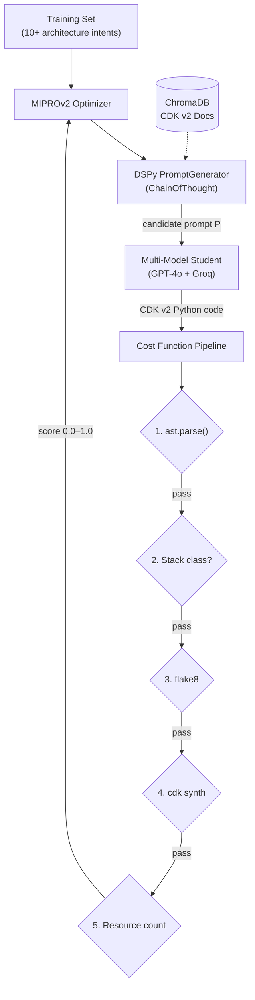

# IaC Prompt Optimizer

A prompt optimization system for AWS CDK v2 code generation. The system treats prompt quality as a continuous cost function and uses DSPy MIPROv2 to search for prompts that maximize the probability of a generic AI agent producing valid, production-ready infrastructure code.

## Problem

LLM-generated Infrastructure-as-Code consistently fails against real compilers. Models hallucinate CDK v1 syntax, invent non-existent class attributes, and pass arguments with incorrect types. The root cause is not that models are bad at code — it's that the **prompts** guiding them lack sufficient specificity about the CDK v2 API surface.

This project inverts the problem: instead of fixing generated code after the fact, we optimize the **prompt** that produces the code, using physical compilation (`cdk synth`) as the sole feedback signal.

## Architecture



### How It Works

1. **MIPROv2 Bayesian search** generates candidate prompt instructions and few-shot demonstrations.
2. Each candidate prompt is fed to **multiple student LLMs** (GPT-4o, Groq) to simulate a generic AI assistant.
3. The student LLM produces AWS CDK v2 Python code from the prompt.
4. The code is scored through a **5-stage cost function**:
   - `ast.parse()` — valid Python syntax (+0.10)
   - Stack class check — contains a class inheriting from `Stack` (+0.10)
   - `flake8` — no undefined names or import errors (+0.10)
   - `cdk synth` — CloudFormation template generated via JSII runtime (+0.50)
   - Resource richness — template contains 3+ resource types (+0.20)
5. MIPROv2 uses the scores to **optimize prompt instructions** via Bayesian search.
6. The best-scoring prompt is exported as a submission-ready document.

### Multi-Model Evaluation

To ensure prompts work with any AI assistant (not just one model), the cost function evaluates each prompt against multiple student LLMs. Groq (free tier) is used alongside GPT-4o. Groq rate limit or token exhaustion errors are handled gracefully — the metric falls back to GPT-4o-only scoring without interrupting the optimization run.

### ChromaDB Knowledge Base

The vector store is pre-populated with real AWS CDK v2 documentation:

- CDK v2 vs v1 migration pitfalls (the primary source of LLM hallucination)
- Correct import paths for common constructs
- Working code examples from the AWS CDK examples repository
- Known type errors and parameter mismatches

The DSPy module queries ChromaDB with the architecture intent and retrieves relevant documentation to ground the generated prompt in real API knowledge.

## Project Structure

| Path | Description |
|---|---|
| `src/dspy_signatures.py` | DSPy `Signature` defining the prompt generator input/output contract. |
| `src/evaluators.py` | Physical compilation metric: AST → flake8 → `cdk synth` → resource scoring. |
| `src/factory.py` | DSPy `Module` wrapping `ChainOfThought`, MIPROv2 training entry point. |
| `src/data_loader.py` | Loads CDK v2 reference data from ChromaDB and training intents. |
| `src/student.py` | Multi-model student LLM dispatcher (GPT-4o + Groq). |
| `src/compiler.py` | CDK synth wrapper: inject code → compile → extract CloudFormation template. |
| `data/training_intents.json` | Architecture intents used as MIPROv2 training examples. |
| `data/cdk_v2_reference/` | Scraped CDK v2 documentation, migration guides, and working examples. |
| `cdk-testing-ground/` | Isolated CDK project directory for physical compilation. |
| `scripts/optimize.py` | Top-level entry point: runs MIPROv2 optimization and exports results. |
| `scripts/evaluate.py` | Evaluates an optimized prompt against held-out intents. |
| `results/` | Per-run optimization artifacts: scores, prompts, generated code. |
| `ui/` | Next.js dashboard for optimization telemetry via Server-Sent Events. |

## Setup

### Prerequisites

- Python 3.8+
- Node.js 20+ (JSII runtime for AWS CDK)
- OpenAI API key with GPT-4o access
- Groq API key (free tier supported)

### Installation

```bash
python -m venv venv
venv\Scripts\activate
pip install -r requirements.txt
```

### Environment Configuration

```bash
cp .env.example .env
```

Populate `OPENAI_API_KEY` and `GROQ_API_KEY` in `.env`.

## Running

### Optimize Prompts

```bash
venv\Scripts\python.exe scripts/optimize.py
```

Runs MIPROv2 optimization across all training intents. The optimized DSPy module is saved to `optimized_factory.json`. Best prompts are exported to `results/`.

### Evaluate on New Intents

```bash
venv\Scripts\python.exe scripts/evaluate.py "serverless GraphQL API with AppSync and DynamoDB"
```

### Dashboard (Optional)

```bash
cd ui
npm install
npm run dev
```

## Cost Function Design

The metric is structured as a series of fast-fail gates to minimize expensive `cdk synth` calls:

| Stage | Points | Time | Purpose |
|---|---|---|---|
| `ast.parse()` | 0.10 | <10ms | Catches syntax errors before compilation |
| Stack class check | 0.10 | <10ms | Ensures valid CDK structure |
| `flake8` | 0.10 | <100ms | Catches undefined names, bad imports |
| `cdk synth` | 0.50 | ~15s | Physical JSII compilation — the ground truth |
| Resource richness | 0.20 | <10ms | Rewards architectural completeness |

Failed prompts are scored in milliseconds. Only prompts passing fast-fail gates pay the 15-second `cdk synth` cost.

## Known Limitations

1. **CDK synth only**: The system validates that code compiles to a CloudFormation template but does not deploy or test runtime behavior.
2. **Groq free tier**: Rate limits may reduce multi-model evaluation frequency. The system degrades gracefully to single-model scoring.
3. **Single-tenant compilation**: Only one CDK stack compiles at a time per working directory. Parallel compilation requires directory isolation.
4. **Windows process cleanup**: Orphaned `node.exe` processes from `cdk synth` are terminated via WMI queries.
