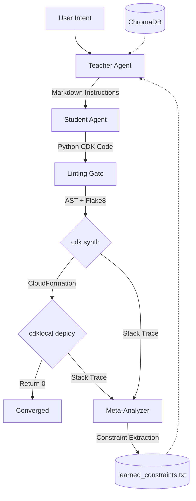

# IaC Self-Healer

A compiler-in-the-loop optimization system for AWS CDK v2 code generation. The system iteratively generates, compiles, and corrects Python infrastructure code until it produces a deployable CloudFormation stack.

## Architecture

LLM-generated Infrastructure-as-Code consistently fails against real compilers due to deprecated APIs, hallucinated class signatures, and type mismatches in the JSII runtime. This project addresses the problem by placing the physical compiler (AWS CDK and LocalStack) directly inside the optimization loop, using compiler tracebacks as the sole feedback signal.

The system uses two LLM agents with distinct roles:

**Teacher Agent** (DSPy `ChainOfThought`): Reads the user's architectural intent, queries a ChromaDB vector store for environment constraints, and produces a natural language instructional prompt. It never generates code.

**Student Agent** (GPT-4o, temperature 0.0): Reads the Teacher's instructions plus a set of hardcoded environment rules and produces raw Python CDK v2 code. It has no memory between iterations.



### Compilation Pipeline

Each iteration runs through four stages:

1. **Prompt Generation**: The Teacher queries ChromaDB for relevant constraints, reads `learned_constraints.txt` for previously extracted fixes, and outputs a markdown prompt describing the desired infrastructure.

2. **Code Synthesis**: Three Student variants are generated concurrently. Each variant is parsed with Python `ast` to verify it contains a valid `Stack` class, then lint-checked with `flake8 --select=E9,F63,F7,F82`. The variant with the fewest errors is selected as the champion.

3. **Physical Compilation**: The champion code is injected into `cdk-testing-ground/cdk_testing_ground/cdk_testing_ground_stack.py`. The CDK compiler runs `npx cdk synth`, which executes the Python code through the JSII runtime and produces a CloudFormation template. This stage catches type errors, missing imports, invalid construct properties, and deprecated API usage.

4. **LocalStack Deployment**: The synthesized template is deployed to a LocalStack Docker container via `npx cdklocal deploy`. This catches service-level failures such as disabled services, invalid resource configurations, and CloudFormation rollback conditions.

### Constraint Feedback Loop

When compilation fails, a Meta-Analyzer agent (GPT-4o) receives the filtered stack trace and extracts concrete fix rules. These rules are appended to `learned_constraints.txt` with a `difflib.SequenceMatcher` deduplication filter (threshold 0.98) to prevent identical constraints from accumulating.

Constraints are injected into the next iteration at two points:

- **Teacher-side**: `data_loader.py` reads `learned_constraints.txt` and injects it into the DSPy context, alongside ChromaDB query results.
- **Student-side**: `execute_prompt.py` includes a hardcoded block of mandatory environment rules in the Student's system prompt. These rules override any conflicting Teacher instructions.

This dual-layer injection was necessary because the Teacher produces natural language (e.g., "Set up an RDS database"), and the Student would faithfully implement it even when the target environment cannot support it.

### Scoring

| Component | Points | Condition |
|---|---|---|
| Python Synthesis | 15 | Valid Python with Stack class |
| Flake8 Lint | 0-20 | -2 points per lint error |
| `cdk synth` | 35 | CloudFormation template generated |
| `cdklocal deploy` | 30 | Stack deployed without rollback |
| **Total** | **100** | |

A topology regression penalty of -50 is applied if the construct count drops by 3 or more between iterations, which indicates the Student is removing resources to avoid errors rather than fixing them.

## Project Structure

| Path | Description |
|---|---|
| `generate.py` | Teacher Agent orchestrator. Runs DSPy prediction and formats the instructional prompt. |
| `scripts/execute_prompt.py` | Student Agent, linting, `cdk synth`, and `cdklocal deploy` pipeline. |
| `scripts/self_healing_optimizer.py` | Top-level iteration loop, scoring, Meta-Analyzer, ChromaDB seeding, constraint deduplication. |
| `src/dspy_signatures.py` | DSPy `Signature` defining Teacher input/output fields. |
| `src/data_loader.py` | Loads AWS context and runtime constraints into the Teacher's prompt. |
| `src/factory.py` | DSPy `Module` wrapping `ChainOfThought`. |
| `cdk-testing-ground/` | Isolated CDK project directory. Contains `lambda/index.py` stub for Lambda asset resolution. |
| `ui/` | Next.js dashboard for iteration telemetry via Server-Sent Events. |
| `results/learning_loop/` | Per-run iteration artifacts: prompts, generated code, stack traces, `run_summary.json`. |

## Setup

### Step 0: Environment Configuration

Duplicate `.env.example` into a local `.env` file at the repository root. Populate all keys before running any commands.

```bash
cp .env.example .env
```

### Prerequisites

- Python 3.8+
- Node.js 20+ (JSII runtime for AWS CDK)
- Docker Desktop with LocalStack container running on port 4566
- OpenAI API key with GPT-4o access

### Installation

```bash
python -m venv venv
venv\Scripts\activate
pip install -r requirements.txt
```

### Dashboard (Optional)

```bash
cd ui
npm install
npm run dev
```

## Running

```bash
venv\Scripts\python.exe scripts\self_healing_optimizer.py "three tier web app with security groups and networking"
```

Iteration logs are written to `results/learning_loop/run_<timestamp>/`. Each iteration directory contains the generated prompt, champion code, and stack trace (if any). `run_summary.json` contains structured telemetry for all iterations.

## Scaling

The bottleneck is the physical compiler (`cdk synth` takes approximately 15 seconds, `cdklocal deploy` approximately 20 seconds), not LLM inference.

- **Local**: Increase Docker Desktop memory allocation to 8GB or more. Consider Groq LPU endpoints to reduce LLM latency.
- **Cloud (GCE)**: Use dedicated `c3` or `n2d-standard-32` instances with persistent Docker daemons.
- **Cloud (GKE)**: Extract `cdk-testing-ground/` into Kubernetes batch jobs with dedicated LocalStack StatefulSets for horizontal compilation parallelism.

## Known Limitations and Future Work

1. **Windows process locking**: Orphaned `node.exe` processes from `cdk synth` are terminated via WMI queries. Containerized sandboxes would eliminate this dependency.
2. **Ephemeral LocalStack state**: Infrastructure resets between deployments. There is no incremental deployment caching.
3. **Single-tenant compilation**: Only one CDK stack compiles at a time per working directory. Parallel compilation requires directory isolation.
4. **Implicit service dependencies**: AWS CDK constructs (e.g., VPC with NAT gateways) trigger implicit SSM Parameter Store lookups during CloudFormation deployment. The LocalStack `SERVICES` environment variable must include all transitively required services.
5. **Constraint accumulation**: The `learned_constraints.txt` deduplication threshold (0.98 similarity) may allow semantically equivalent but textually distinct constraints through. A production system would benefit from embedding-based deduplication.
6. **DSPy unused optimization**: The codebase includes MIPROv2 imports and a `train()` function, but the active loop uses only `ChainOfThought` for zero-shot generation. The MIPROv2 optimizer is not invoked during runtime.
