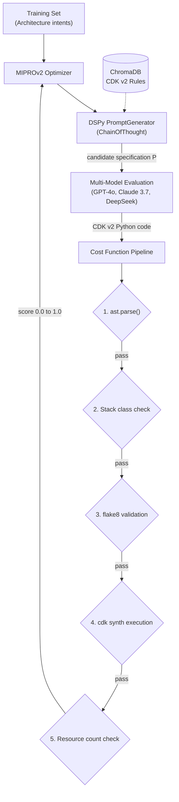

# Compiler-in-the-Loop IaC Generation

A generation system for AWS CDK v2 architectures. The system processes output quality as a discrete cost function and utilizes DSPy MIPROv2 to execute a Bayesian search for architectural specifications that maximize the probability of an inference model producing valid infrastructure code.

## Problem

Language model-generated Infrastructure-as-Code consistently fails against explicit compilers. Inference models often output CDK v1 syntax, reference non-existent class attributes, and pass arguments with incorrect structural types. The technical failure occurs because the instructions guiding the inference process lack strict specificity regarding the CDK v2 API surface.

This repository implements an inverted optimization pipeline. Instead of modifying generated code post-inference, the system optimizes the input specification itself and utilizes physical compilation (cdk synth) as the sole validation mechanism.

## Architecture



### Protocol Execution

1. MIPROv2 Bayesian search generates candidate parameter instructions and few-shot demonstrations.
2. The candidate specification is routed to multiple evaluation models (e.g., GPT-4o, Claude 3.7, DeepSeek Chat) to simulate standard execution constraints.
3. The evaluation models produce AWS CDK v2 Python routines derived from the input specification.
4. The resulting codebase is evaluated through a strict 5-stage cost function pipeline:
   * `ast.parse()`: validates Python syntax structure (+0.10)
   * Stack verification: confirms presence of a class inheriting from `Stack` (+0.10)
   * `flake8`: detects undefined references or import failures (+0.10)
   * `cdk synth`: generates CloudFormation templates via the JSII runtime environment (+0.50)
   * Resource verification: detects presence of three or more infrastructure resource types (+0.20)
5. MIPROv2 consumes the numeric score distribution to optimize the instruction parameters via internal search mechanics.
6. The exact specification resulting in the highest validation score across all models is output as a markdown document.

### Multi-Model Evaluation

To prevent localized overfitting to a specific foundation model's parameter weights, the cost function executes against a concurrent, multi-model dispatcher. Primary evaluation runs on GPT-4o. Secondary evaluation runs via OpenRouter integrations routing to Claude 3.7 Sonnet, DeepSeek Chat, and Llama 3.3. HTTP rate limit anomalies degrade the metric sequentially without terminating the core optimization algorithm.

### ChromaDB Knowledge Base

The system injects AWS CDK v2 documentation stored in a local ChromaDB instance to constrain generated instructions:
* Syntactic variations and structural shifts between CDK v1 and v2.
* Explicit import paths for specialized constructs.
* Static code examples from the verified AWS instances.
* Known API parameter mismatch definitions.

The DSPy module queries ChromaDB utilizing the architecture intent dataset to retrieve the required documentation structures needed to ground the instruction parameters.

## Project Structure

| Path | Description |
|---|---|
| `src/dspy_signatures.py` | DSPy Signature defining the prompt generator input/output constraints. |
| `src/evaluators.py` | Physical compilation validation metrics. |
| `src/factory.py` | DSPy Module wrapping ChainOfThought and MIPROv2 optimization logic. |
| `src/data_loader.py` | Retrieval logic for CDK reference mechanisms. |
| `src/student.py` | Multi-model evaluation dispatcher for OpenAI and OpenRouter endpoints. |
| `src/compiler.py` | Subprocess wrapper for the physical JSII synthesis execution. |
| `data/training_intents.json` | Architecture intents utilized as training arrays. |
| `cdk-testing-ground/` | Isolated CDK execution workspace for JSII interaction. |
| `scripts/optimize.py` | Core execution endpoint for Bayesian optimization iterations. |
| `results/` | Output directory for optimization metadata and final specification files. |

## Step 0: Environment Configuration

Before executing the setup scripts or optimization commands, you must configure the local environment keys.
Copy the `.env.example` file to create a local `.env` configuration file:

```bash
cp .env.example .env
```

You must populate all required variables (e.g., OPENAI_API_KEY, OPENROUTER_API_KEY) within the `.env` file exactly as specified in the example comments before proceeding.

## Setup

### Prerequisites

* Python 3.10 or newer
* Node.js 20 or newer (mandatory for AWS CDK CLI and JSII runtime functionality)
* Valid OpenAI API key
* Valid OpenRouter API key

### Installation

```bash
python -m venv venv
venv\Scripts\activate
pip install -r requirements.txt
```

## Running the Architecture

### Executing the Optimizer

```bash
venv\Scripts\python.exe scripts/optimize.py --auto medium
```

This command executes the MIPROv2 process across the training intents array. The optimized DSPy schema state is written to `optimized_factory.json`. The highest-scoring generalized outputs are written to the `results/` directory.

## Known Limitations & Future Work

1. Runtime Testing Constraints: The system evaluates infrastructure statically by verifying that code successfully compiles a valid CloudFormation graph via JSII. It does not provision physical resources to AWS nor evaluate if those architectures function during live operational deployment. This can allow logical network failures (e.g., misconfigured security group routing) to pass evaluation stages.
2. Concurrent Execution Boundaries: The physical compiler engine mandates a localized `cdk.out` output directory. This prevents dynamic, multi-threaded parallel execution of the `cdk synth` validation within the same working repository. Scaling the evaluator currently requires sequential processing loops.
3. Windows Operating System Dependencies: Residual background `node.exe` processes invoked by the JSII engine are terminated explicitly utilizing Windows Management Instrumentation (WMI) shell queries (`wmic process`). Native deployment of this optimization suite on standard Linux environments currently requires manual adjustment of the termination commands in the evaluator.
4. Latency Overhead: The Bayesian search model relies on exhaustive API evaluation cycles spanning multiple parameters and concurrent endpoints. Running the optimization engine on dense enterprise architectures can consume up to 45 minutes of processing overhead prior to convergence.
