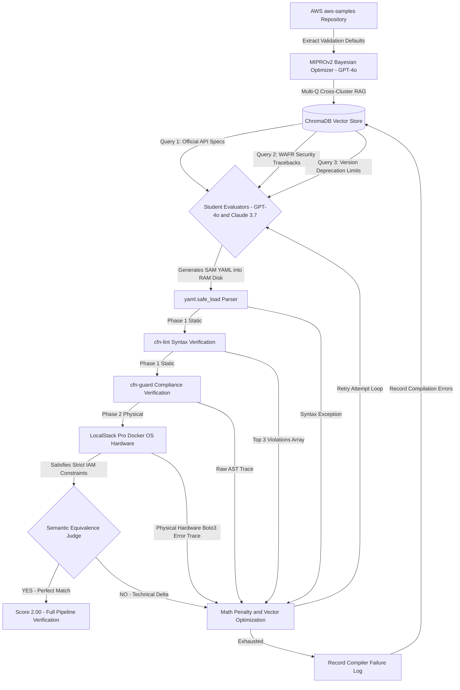

# Automated Serverless Infrastructure Engine

This repository provides a static evaluation pipeline for optimizing generated Infrastructure as Code (IaC) templates. The system integrates the DSPy MIPROv2 framework to compute optimized prompt parameters, enabling the generation of AWS Serverless Application Model (SAM) architectures that comply with AWS Well-Architected Framework guidelines.

## Architecture Workflow



## Core Evaluation Components

1. **Pre-emptive Data Ingestion:** The system parses `d1uauaxba7bl26.cloudfront.net` during initialization to download documented AWS CloudFormation schema parameters into a local ChromaDB instance.
2. **Multi-Architecture Validation:** Prompt instruction synthesis utilizes `gpt-4o` natively as the primary optimizer matrix. To evaluate generated prompts efficiently, the pipeline enforces strict testing simultaneously against multiple distinct foundation models (`gpt-4o` and `anthropic/claude-3.7-sonnet`). By averaging their compilation scores, the engine prevents neural bias and enforces true prompt generalization across distinct semantic architectures.
3. **Continuous Scoring Functions (`math.exp`):** The optimization gradients scale linearly against partial code outputs. A template passing 15 of 20 validation checks calculates a mathematically higher score multiplier than a template with complete structural failure, bypassing discrete boolean logic gates. The pipeline computes the evaluation vector using exponential parameter decay:

   ```math
   \text{Total Score} = \max(0, [0.20 + 0.40e^{-0.5 L} + 0.40e^{-0.5 G} + 0.20 S] - 0.10 A)
   ```

   Where `L` represents the total count of `cfn-lint` syntax errors, `G` represents the total count of `cfn-guard` compliance violations, `S ∈ {0, 1}` maps structural intent via the LLM semantic judge, and `A ∈ {0, 1, 2}` tracks recursive generation attempt penalties.
4. **Semantic Verification:** To achieve maximum execution parameters, the script utilizes `gpt-4o` to physically compare output semantic alignments against input specifications, validating structures beyond basic `cfn-lint` syntax.
5. **Bootstrapped Dataset Execution:** The codebase implements an extraction script that queries the `aws-samples/serverless-patterns` repository. It filters and provides compliant SAM architectures mapped to explicitly defined architecture targets. MIPROv2 passes these examples into the DSPy instances as execution parameters.
6. **RAM Disk Target Generation:** The codebase performs temporary verification workloads into a volatile system RAM drive (e.g., `R:\`) to bypass physical SSD input/output latency associated with the execution of the `cfn-lint` and `cfn-guard` binaries.

## Step 0: Environment Configuration

Before running any script logic, configure the required system constraints. Copy the provided `.env.example` file to create your `.env` configuration file and populate all listed variables.

```bash
cp .env.example .env
```

Review the `.env` structure:
* `OPENAI_API_KEY`: API authentication key.
* `OPENROUTER_API_KEY`: API authentication key utilized for OpenRouter requests.
* `LOCALSTACK_AUTH_TOKEN`: Pro/Ultimate environment variable required to trigger strict `ENFORCE_IAM=1` sandbox matrices globally.

## Installation

```bash
python -m venv venv
venv\Scripts\activate
pip install -r requirements.txt
```

To function correctly, the host system must map system aliases pointing to the evaluation binaries:
* Execute `pip install cfn-lint` inside the virtual environment for linting logic.
* Download the `cfn-guard` executable directly and attach it within `./venv/Scripts/cfn-guard.exe`.

## Execution Commands

Initialize the vector database locally (Requires Internet Connection):

```bash
venv\Scripts\python.exe scripts/ingest_sam_docs.py
```

Begin parameter alignment with standard optimization thresholds:

```bash
venv\Scripts\python.exe scripts/optimize.py --auto medium
```

If previous evaluation data exists securely on disk, initialize the recovery state by specifying the resume flag:

```bash
venv\Scripts\python.exe scripts/optimize.py --auto medium --resume
```

## Known Limitations & Future Work

1. **Nested OS Virtualization:** The Phase 2 LocalStack container instance functionally operates in runtime isolation. Serverless Lambdas dynamically requesting Docker layers (e.g. nested Python/Go compilation instructions) trigger execution exceptions without an explicit mapping to `/var/run/docker.sock` passed internally into the `subprocess` bindings.
2. **Security Protocol Generalization:** The `cfn-guard` policies exclusively check JSON syntax structures by mapping them to local logic files. A language model implicitly trained against the pipeline architecture could format schema implementations to bypass string pattern matching algorithms, leaving the underlying architecture explicitly vulnerable to zero-day logic exploits.
3. **Windows Operating System Dependency:** The virtual environment binary routing (`cfn-guard.exe`) relies on standard Windows NT file path formats. A Linux machine requires structural path rewriting inside `evaluators.py`.
