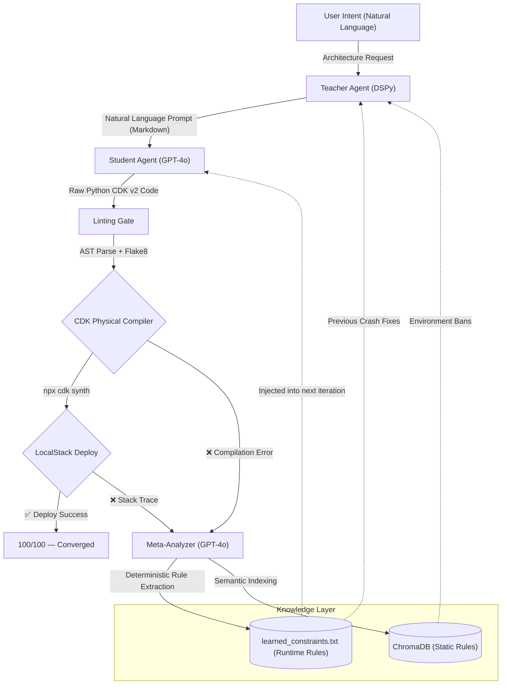

# IaC Self-Healer

An autonomous orchestration system that generates, compiles, deploys, and self-corrects AWS CDK v2 infrastructure code — converging on physically deployable cloud architecture without human intervention.

## The Problem

Generating Infrastructure-as-Code (IaC) via zero-shot Large Language Models produces code that _looks_ correct but fails deterministically against real compilers. Common failure modes include deprecated CDK v1 namespaces, hallucinated API surfaces, missing JSII type constraints, and service-level incompatibilities with emulated cloud environments. Traditional approaches (few-shot examples, chain-of-thought prompting) cannot fix these issues because they lack a physical feedback loop — they never actually _compile_ the code.

## The Solution: Teacher-Student Zero-Trust Architecture

IaC Self-Healer decomposes the generation problem into two cooperating LLM agents, each with a distinct role, connected by a deterministic physical compiler that acts as the sole source of truth.



### Why Two Agents?

A single LLM tasked with both _designing_ and _coding_ infrastructure conflates two fundamentally different skills. The Teacher-Student split enforces separation of concerns:

- **Teacher (DSPy `ChainOfThought`)**: Reads the user's intent, queries ChromaDB for environment-specific limitations and previously learned constraints, and produces a **natural language instructional prompt** — never code. This ensures the architectural decisions are informed by accumulated knowledge without leaking implementation details.
- **Student (GPT-4o, Temperature 0.0)**: Receives the Teacher's markdown instructions plus a hardcoded set of **Mandatory Environment Rules** (e.g., "Never use `aws_rds` in LocalStack") and produces raw Python CDK code. The Student has zero memory between iterations — it is purely reactive.

### Zero-Trust Physical Proofing

The system deliberately rejects all abstract LLM-based code review. Early iterations included a "Static Critic" agent that would review generated code before compilation. This was removed after it caused infinite hallucination loops — the critic would reject valid code, or approve invalid code, because it was guessing about compiler behavior rather than observing it.

Instead, the system uses a three-stage physical validation gauntlet:

1. **AST + Flake8 Linting**: Python's `ast.parse()` verifies the code is syntactically valid and contains a proper `Stack` class inheritance. `flake8` catches undefined names and import errors.
2. **`npx cdk synth`**: The actual AWS CDK compiler executes the Python code through the JSII runtime, generating a CloudFormation template. This catches type errors, missing construct properties, deprecated APIs, and invalid resource configurations that no LLM linter could reliably detect.
3. **LocalStack Deployment**: The synthesized CloudFormation template is deployed to a local LocalStack Docker container via `cdklocal deploy`. This catches service-level failures (e.g., SSM not enabled, RDS requiring a Pro license).

### Deterministic Context Reflection

When compilation fails, the raw stack trace is extracted, filtered (removing JSII `UserWarning` noise and `typeguard` protocol warnings), and sent to a **Meta-Analyzer** agent. This agent's sole job is to translate the physical error into a concrete, actionable constraint rule. For example:

| Stack Trace Error | Generated Constraint |
|---|---|
| `AttributeError: 'CdkTestingGroundStack' object has no attribute 'removal_policy'` | `Use RemovalPolicy.DESTROY directly, never Stack.of(self).removal_policy` |
| `Cannot find asset at ...existing_lambda_directory` | `Use Code.from_inline() instead of from_asset() when directory doesn't exist` |
| `Service 'ssm' is not enabled` | `Use ec2.MachineImage.generic_linux({'us-east-1': 'ami-12345'}) instead of SSM lookups` |

These constraints are written to `learned_constraints.txt` and injected verbatim into the next iteration's prompt. A **`difflib.SequenceMatcher` deduplication filter** (threshold 0.98) prevents semantically identical constraints from accumulating across iterations.

### Dual-Layer Constraint Injection

A critical architectural insight: constraints must reach **both** agents, not just the Teacher.

- **Teacher-side**: The `learned_constraints.txt` file is read by `data_loader.py` and injected into the DSPy context. The ChromaDB vector store holds static environment rules that persist across runs.
- **Student-side**: The Student Coder's system prompt in `execute_prompt.py` contains hardcoded **Mandatory Environment Rules** that override any conflicting Teacher instructions. This prevents the Student from blindly following a Teacher instruction like "Set up an RDS database" when the environment cannot support RDS.

## Scoring Algorithm

Each iteration produces a score from 0-100:

| Component | Points | Condition |
|---|---|---|
| Python Synthesis | 15 | Code is valid Python |
| Flake8 Lint | 0–20 | Deduct 2 points per lint error |
| `cdk synth` Success | 35 | CloudFormation template generated |
| LocalStack Deploy | 30 | Stack deployed without rollback |
| **Total** | **100** | **Full convergence** |

Additional penalties:
- **Topology Regression (-50)**: If construct count drops by ≥3 between iterations, indicating the Student is "solving" errors by deleting resources.
- **Temperature Escalation**: If scores stagnate for 3+ consecutive iterations, the generation temperature increases by 0.1 to escape local minima.

## Project Structure

| Path | Purpose |
|---|---|
| `generate.py` | Teacher Agent orchestrator. Runs DSPy prediction, applies Editor formatting, injects learned constraints into final markdown. |
| `scripts/execute_prompt.py` | Student Agent + physical validation gauntlet. Generates 3 code variants, lints them, selects champion, runs `cdk synth` and `cdklocal deploy`. |
| `scripts/self_healing_optimizer.py` | Top-level orchestration loop. Manages iterations, scoring, Meta-Analyzer invocation, ChromaDB seeding, and constraint deduplication. |
| `src/dspy_signatures.py` | DSPy `Signature` defining the Teacher's input/output contract. |
| `src/data_loader.py` | Loads AWS context + runtime constraints from `learned_constraints.txt` into the Teacher's prompt. |
| `src/factory.py` | DSPy `Module` wrapping `ChainOfThought` with the prompt signature. |
| `cdk-testing-ground/` | Isolated CDK project directory where generated code is injected and compiled. |
| `ui/` | Next.js dashboard for real-time telemetry via Server-Sent Events. |
| `results/learning_loop/` | Iteration artifacts: prompts, generated code, stack traces, and `run_summary.json` telemetry. |

## Installation

### Prerequisites
- Python 3.8+
- Node.js 20+ (JSII runtime for AWS CDK)
- Docker Desktop (LocalStack container)
- OpenAI API key

### Setup
```bash
python -m venv venv
venv\Scripts\activate
pip install -r requirements.txt
cp .env.example .env  # Populate OPENAI_API_KEY
```

### Dashboard
```bash
cd ui
npm install
npm run dev
```

## Running the Engine

### Via CLI (Direct)
```bash
venv\Scripts\python.exe scripts\self_healing_optimizer.py "simple three tier web app with security and networking"
```

### Via Dashboard
1. Run `npm run dev` in `ui/` and navigate to `localhost:3000`.
2. Enter an architectural intent in natural language.
3. Monitor iteration progress in real-time. Logs persist to `results/learning_loop/run_<timestamp>/`.

## Scaling Considerations

The bottleneck is the physical compiler (`cdk synth` ~15s, `cdklocal deploy` ~20s), not LLM inference. Scaling strategies:

- **Local**: Increase Docker Desktop memory to ≥8GB. Consider Groq LPU endpoints to minimize TTFT.
- **Cloud (GCE)**: Dedicated `c3` or `n2d-standard-32` instances with persistent Docker daemons.
- **Cloud (GKE)**: Extract `cdk-testing-ground/` into Kubernetes batch jobs with dedicated LocalStack StatefulSets for horizontal compilation parallelism.

## Known Limitations

1. **Windows Process Locking**: Orphaned `node.exe` processes from `cdk synth` are terminated via WMI. Containerized sandboxes would eliminate this.
2. **Ephemeral LocalStack State**: Infrastructure resets between deployments. No incremental deployment caching.
3. **Single-Tenant Compilation**: Only one CDK stack compiles at a time per working directory. Parallel compilation requires directory isolation.
